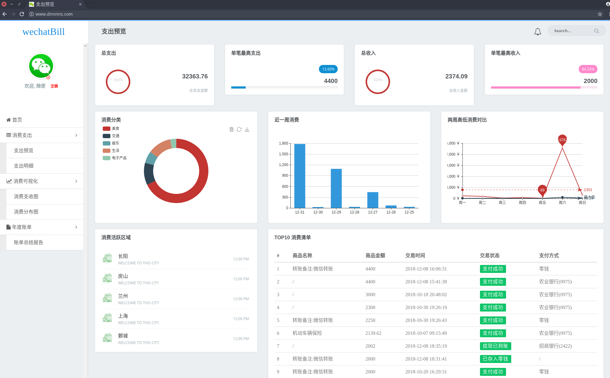
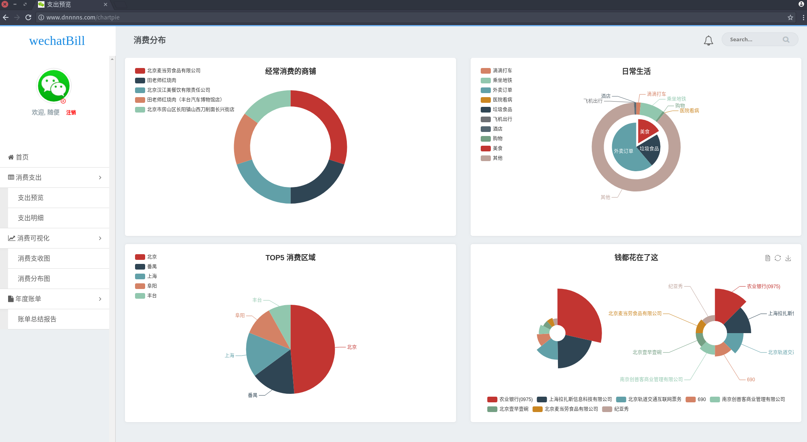
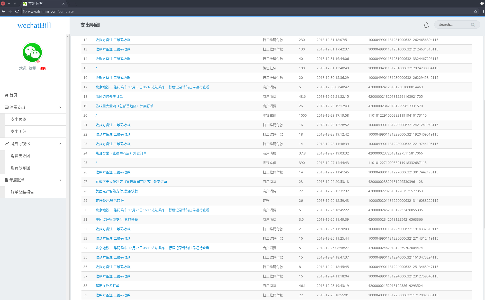
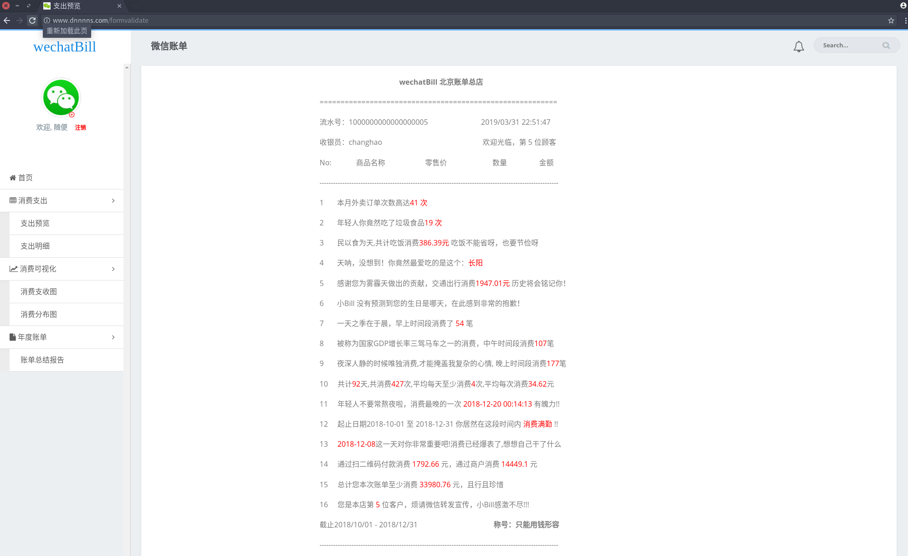
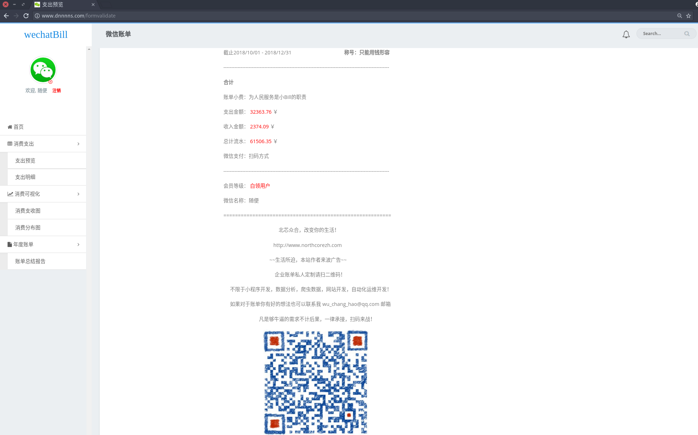
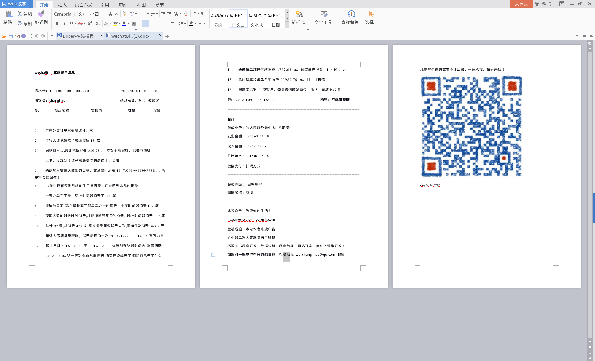

**wechatBill 微信账单可视化分析项目**  

    版本：vp1.4.1

    项目创建时间：2019.03.14

    上次修改时间：2019.03.31 02:12

    最后修改时间：2019.03.31 18:11

    Author: changhao

    Mail: wu_chang_hao@qq.com
      
    Demo演示网址： http://www.dnnnns.com

  
**运行程序**
  
    1. python wechatBill.py
  
    2. 浏览器访问: http://127.0.0.1:8080
  
    3. 帐号 changhao  密码 changhao
  

  
**主要功能**
  
    1. eChart展示
  
    2. 预测功能
  
    3. 报表生成
  
    4. 词库中心

**changelog**
    1. 
    2.

**未实现功能**
  
    1. 多用户登录
  
    2. cookie 超时
  

**技术实现**
  
    Flask + Python3.6 + sqlite3 + Markdown + Bootstrap
  

  
**长期承接项目**
  
    (小程序开发、数据分析、爬虫数据、网站开发、自动化运维开发、脚本制作、应用程序开发)
  
  
**废话不多说直接上图**

  
  

  

  

  

  

  

  

